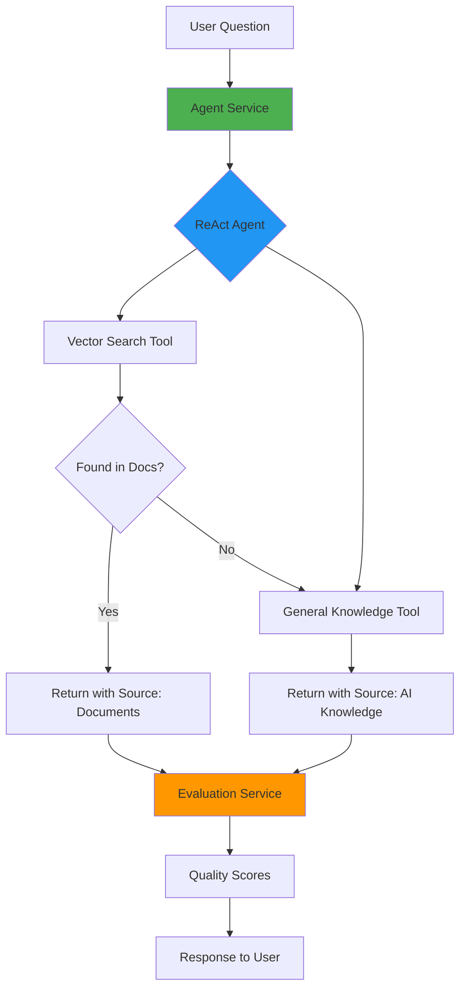

# AI-Agentic System MVP - Step-by-Step Implementation Guide

## Overview
This guide provides detailed steps to transform the RAG chatbot into an AI-Agentic system with reasoning, tool-calling, reflection, and evaluation.

---

## Phase 1: Create Tools (30 min)

### Step 1.1: Create Vector Search Tool (15 min)

**File**: `server/services/tools/vectorSearchTool.js`

**Purpose**: Wrap existing Qdrant vector store to search uploaded documents

**Implementation**:
```javascript
import { DynamicStructuredTool } from '@langchain/core/tools';
import { z } from 'zod';

export function createVectorSearchTool(vectorStore) {
  return new DynamicStructuredTool({
    name: 'vector_search',
    description: 'Search through uploaded documents to find relevant information. Use this when the user asks about their uploaded PDFs or audio files.',
    schema: z.object({
      query: z.string().describe('The search query to find in documents'),
    }),
    func: async ({ query }) => {
      const retriever = vectorStore.asRetriever({ k: 3 });
      const results = await retriever.getRelevantDocuments(query);
      
      if (results.length === 0) {
        return JSON.stringify({ found: false, message: 'No relevant documents found' });
      }
      
      return JSON.stringify({
        found: true,
        results: results.map(doc => doc.pageContent),
        source: 'documents'
      });
    },
  });
}
```

**Dependencies**: Install zod
```bash
cd server
npm install zod
```

---

### Step 1.2: Create General Knowledge Tool (15 min)

**File**: `server/services/tools/generalKnowledgeTool.js`

**Purpose**: Use GPT's built-in knowledge when documents don't have the answer

**Implementation**:
```javascript
import { DynamicStructuredTool } from '@langchain/core/tools';
import { ChatOpenAI } from '@langchain/openai';
import { z } from 'zod';
import { OPENAI_API_KEY } from '../../constants.js';

export function createGeneralKnowledgeTool() {
  const llm = new ChatOpenAI({
    apiKey: OPENAI_API_KEY,
    model: 'gpt-3.5-turbo',
    temperature: 0.7,
  });

  return new DynamicStructuredTool({
    name: 'general_knowledge',
    description: 'Answer questions using AI general knowledge. Use this when documents do not contain the answer or for general questions.',
    schema: z.object({
      question: z.string().describe('The question to answer using general knowledge'),
    }),
    func: async ({ question }) => {
      const response = await llm.invoke(question);
      return JSON.stringify({
        answer: response.content,
        source: 'AI knowledge'
      });
    },
  });
}
```

---

## Phase 2: Create Agent Service (45 min)

### Step 2.1: Create Agent Service (45 min)

**File**: `server/services/agentService.js`

**Purpose**: Main agentic system using LangChain ReAct agent

**Implementation**:
```javascript
import { ChatOpenAI } from '@langchain/openai';
import { AgentExecutor, createReactAgent } from 'langchain/agents';
import { ChatPromptTemplate } from '@langchain/core/prompts';
import { OPENAI_API_KEY } from '../constants.js';
import { createVectorSearchTool } from './tools/vectorSearchTool.js';
import { createGeneralKnowledgeTool } from './tools/generalKnowledgeTool.js';

export class AgentService {
  constructor(vectorStore) {
    this.vectorStore = vectorStore;
    this.llm = new ChatOpenAI({
      apiKey: OPENAI_API_KEY,
      model: 'gpt-4',
      temperature: 0,
    });
  }

  async processQuery(message) {
    // Create tools
    const tools = [
      createVectorSearchTool(this.vectorStore),
      createGeneralKnowledgeTool(),
    ];

    // Create ReAct prompt
    const prompt = ChatPromptTemplate.fromTemplate(`
      You are a helpful AI assistant with access to tools.
      
      Answer the user's question using the available tools.
      First, try to search uploaded documents. If no relevant information is found, use general knowledge.
      
      TOOLS:
      {tools}
      
      TOOL NAMES: {tool_names}
      
      Question: {input}
      
      Thought: {agent_scratchpad}
    `);

    // Create agent
    const agent = await createReactAgent({
      llm: this.llm,
      tools,
      prompt,
    });

    // Create executor
    const executor = new AgentExecutor({
      agent,
      tools,
      verbose: true,
      returnIntermediateSteps: true,
    });

    // Execute
    const result = await executor.invoke({ input: message });

    // Extract reasoning and tools used
    const reasoning = result.intermediateSteps.map(step => ({
      action: step.action.tool,
      input: step.action.toolInput,
      output: step.observation,
    }));

    const toolsUsed = [...new Set(reasoning.map(r => r.action))];

    return {
      answer: result.output,
      reasoning,
      toolsUsed,
      source: this.determineSource(reasoning),
    };
  }

  determineSource(reasoning) {
    const lastStep = reasoning[reasoning.length - 1];
    if (!lastStep) return 'unknown';
    
    try {
      const output = JSON.parse(lastStep.output);
      return output.source || 'unknown';
    } catch {
      return 'unknown';
    }
  }
}
```

**Dependencies**: Install langchain agents
```bash
cd server
npm install langchain
```

---

## Phase 3: Create Evaluation Service (30 min)

### Step 3.1: Create Evaluation Service (30 min)

**File**: `server/services/evaluationService.js`

**Purpose**: Self-evaluate agent responses for quality

**Implementation**:
```javascript
import { ChatOpenAI } from '@langchain/openai';
import { OPENAI_API_KEY } from '../constants.js';

export class EvaluationService {
  constructor() {
    this.llm = new ChatOpenAI({
      apiKey: OPENAI_API_KEY,
      model: 'gpt-3.5-turbo',
      temperature: 0,
    });
  }

  async evaluateResponse(question, answer, toolsUsed) {
    const prompt = `
      Evaluate the following AI response on a scale of 1-5 for each criterion:
      
      Question: ${question}
      Answer: ${answer}
      Tools Used: ${toolsUsed.join(', ')}
      
      Provide scores (1-5) for:
      1. Relevance: How relevant is the answer to the question?
      2. Clarity: How clear and understandable is the answer?
      3. Tool Effectiveness: Were the right tools used?
      
      Respond in JSON format:
      {
        "relevance": <score>,
        "clarity": <score>,
        "toolEffectiveness": <score>,
        "feedback": "<brief explanation>"
      }
    `;

    const response = await this.llm.invoke(prompt);
    
    try {
      return JSON.parse(response.content);
    } catch {
      return {
        relevance: 3,
        clarity: 3,
        toolEffectiveness: 3,
        feedback: 'Unable to parse evaluation',
      };
    }
  }
}
```

---

## Phase 4: Integration (30 min)

### Step 4.1: Update Services Index (5 min)

**File**: `server/services/index.js`

**Add**:
```javascript
import { AgentService } from './agentService.js';
import { EvaluationService } from './evaluationService.js';

const agentService = new AgentService(qdrantService.vectorStore);
const evaluationService = new EvaluationService();

export const services = {
  qdrantService,
  ragService,
  pdfService,
  textSplitterService,
  audioService,
  agentService,        // Add this
  evaluationService,   // Add this
};
```

---

### Step 4.2: Update Chat Route (25 min)

**File**: `server/routes/chat.js`

**Replace with**:
```javascript
import express from 'express';
import { services } from '../services/index.js';

export const chatRouter = express.Router();

chatRouter.post('/chat', async (req, res) => {
  try {
    const { message } = req.body;

    // Use agent service instead of RAG
    const agentResult = await services.agentService.processQuery(message);

    // Evaluate the response
    const evaluation = await services.evaluationService.evaluateResponse(
      message,
      agentResult.answer,
      agentResult.toolsUsed
    );

    res.json({
      answer: agentResult.answer,
      reasoning: agentResult.reasoning,
      toolsUsed: agentResult.toolsUsed,
      source: agentResult.source,
      evaluation,
    });
  } catch (error) {
    console.error('Chat error:', error);
    res.status(500).json({ error: 'Failed to process chat message' });
  }
});
```

---

## Phase 5: Frontend Updates (45 min)

### Step 5.1: Update Types (5 min)

**File**: `client/src/types.ts`

**Add**:
```typescript
export interface AgentTrace {
  action: string;
  input: any;
  output: string;
}

export interface Evaluation {
  relevance: number;
  clarity: number;
  toolEffectiveness: number;
  feedback: string;
}

export interface ChatMessage {
  text: string;
  sender: 'user' | 'bot';
  timestamp: Date;
  reasoning?: AgentTrace[];
  toolsUsed?: string[];
  source?: string;
  evaluation?: Evaluation;
}
```

---

### Step 5.2: Update Chat Component (40 min)

**File**: `client/src/components/Chat.tsx`

**Add after imports**:
```typescript
import { ChevronDown, ChevronUp, Wrench, Brain, Star } from 'lucide-react';
```

**Add state for expanded traces**:
```typescript
const [expandedTraces, setExpandedTraces] = useState<Set<number>>(new Set());

const toggleTrace = (index: number) => {
  const newExpanded = new Set(expandedTraces);
  if (newExpanded.has(index)) {
    newExpanded.delete(index);
  } else {
    newExpanded.add(index);
  }
  setExpandedTraces(newExpanded);
};
```

**Update handleSendMessage to capture agent data**:
```typescript
const botMessage: ChatMessage = {
  text: response.data.answer,
  sender: 'bot',
  timestamp: new Date(),
  reasoning: response.data.reasoning,
  toolsUsed: response.data.toolsUsed,
  source: response.data.source,
  evaluation: response.data.evaluation,
};
```

**Add Agent Trace Display (after message text)**:
```typescript
{message.sender === 'bot' && message.reasoning && (
  <div className="mt-3 space-y-2">
    <button
      onClick={() => toggleTrace(index)}
      className="flex items-center gap-2 text-xs text-muted-foreground hover:text-foreground transition-colors"
    >
      <Brain className="w-3 h-3" />
      <span>Agent Trace</span>
      {expandedTraces.has(index) ? (
        <ChevronUp className="w-3 h-3" />
      ) : (
        <ChevronDown className="w-3 h-3" />
      )}
    </button>

    {expandedTraces.has(index) && (
      <div className="bg-background/50 rounded-lg p-3 space-y-2 text-xs">
        {/* Tools Used */}
        {message.toolsUsed && (
          <div className="flex items-center gap-2">
            <Wrench className="w-3 h-3" />
            <span className="font-medium">Tools:</span>
            <span>{message.toolsUsed.join(', ')}</span>
          </div>
        )}

        {/* Source */}
        {message.source && (
          <div className="flex items-center gap-2">
            <span className="font-medium">Source:</span>
            <span className="px-2 py-0.5 bg-primary/10 rounded">
              {message.source}
            </span>
          </div>
        )}

        {/* Evaluation */}
        {message.evaluation && (
          <div className="space-y-1">
            <div className="flex items-center gap-2">
              <Star className="w-3 h-3" />
              <span className="font-medium">Quality Scores:</span>
            </div>
            <div className="pl-5 space-y-1">
              <div>Relevance: {message.evaluation.relevance}/5</div>
              <div>Clarity: {message.evaluation.clarity}/5</div>
              <div>Tool Use: {message.evaluation.toolEffectiveness}/5</div>
            </div>
          </div>
        )}

        {/* Reasoning Steps */}
        <div className="space-y-1">
          <span className="font-medium">Reasoning:</span>
          {message.reasoning.map((step, i) => (
            <div key={i} className="pl-3 border-l-2 border-primary/20">
              <div className="font-medium">{step.action}</div>
              <div className="text-muted-foreground">
                {typeof step.output === 'string' 
                  ? step.output.substring(0, 100) + '...'
                  : JSON.stringify(step.output).substring(0, 100) + '...'}
              </div>
            </div>
          ))}
        </div>
      </div>
    )}
  </div>
)}
```

---

## Phase 6: Documentation (30 min)

### Step 6.1: Create Architecture Diagram (15 min)

**File**: `architecture.mmd`



---

### Step 6.2: Update README (15 min)

**File**: `README.md`

**Add section after "Features"**:

```markdown
## Agentic AI Features

This chatbot uses an autonomous AI-Agentic system with:

### Reasoning & Tool-Calling
- **ReAct Agent**: Uses Chain-of-Thought reasoning to decide which tools to use
- **Vector Search Tool**: Searches uploaded documents for relevant information
- **General Knowledge Tool**: Falls back to AI's built-in knowledge when documents don't have answers

### Reflection & Evaluation
- **Self-Evaluation**: Automatically scores responses on relevance, clarity, and tool effectiveness
- **Quality Metrics**: Provides 1-5 scores for each response dimension
- **Reasoning Traces**: Shows step-by-step decision-making process

### Agent Decision Flow
1. User asks a question
2. Agent analyzes intent and selects appropriate tool
3. Tries Vector Search first (uploaded documents)
4. Falls back to General Knowledge if needed
5. Evaluates its own response quality
6. Returns answer with reasoning trace and source attribution

### Technologies
- **LangChain ReAct Agent**: Autonomous reasoning and tool selection
- **OpenAI GPT-4**: Agent reasoning engine
- **OpenAI GPT-3.5-turbo**: Response generation and evaluation
- **Qdrant Vector Store**: Document retrieval
- **Zod**: Tool schema validation
```

---

## Testing Checklist

### Test Case 1: Document Question
- Upload a PDF
- Ask: "What is the main topic of the document?"
- Expected: Uses vector_search tool, returns document-based answer

### Test Case 2: General Question
- Ask: "What is artificial intelligence?"
- Expected: Uses general_knowledge tool, returns AI knowledge

### Test Case 3: Fallback Scenario
- Ask: "Tell me about chapter 10" (when chapter 10 doesn't exist)
- Expected: Tries vector_search (fails), falls back to general_knowledge

### Test Case 4: Agent Trace Display
- Check that reasoning steps are visible
- Verify tool names are shown
- Confirm source attribution is correct
- Validate evaluation scores appear

---

## Troubleshooting

### Issue: Agent not using tools
**Solution**: Check that tools are properly registered in agentService.js

### Issue: Evaluation returns default scores
**Solution**: Verify GPT response is valid JSON, check API key

### Issue: Frontend not showing traces
**Solution**: Verify response structure matches ChatMessage interface

### Issue: "Module not found" errors
**Solution**: Run `npm install` in both client and server directories

---

## Next Steps (Post-MVP)

1. Add more tools (calculator, web search)
2. Implement conversation memory
3. Add streaming responses
4. Create evaluation dashboard
5. Add tool execution sandboxing
6. Implement error recovery logic

---

## Estimated Time: 3 hours total
- Phase 1: 30 min
- Phase 2: 45 min
- Phase 3: 30 min
- Phase 4: 30 min
- Phase 5: 45 min
- Phase 6: 30 min
